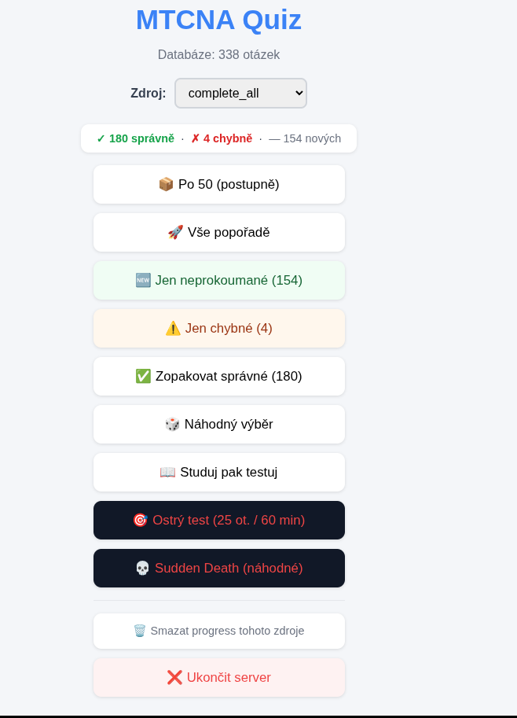
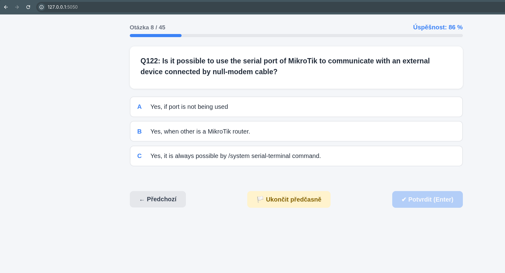
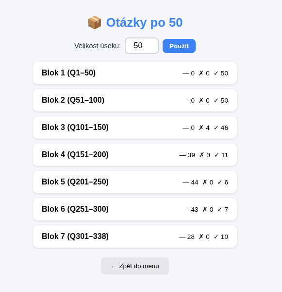
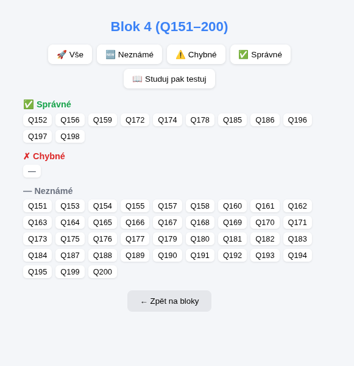
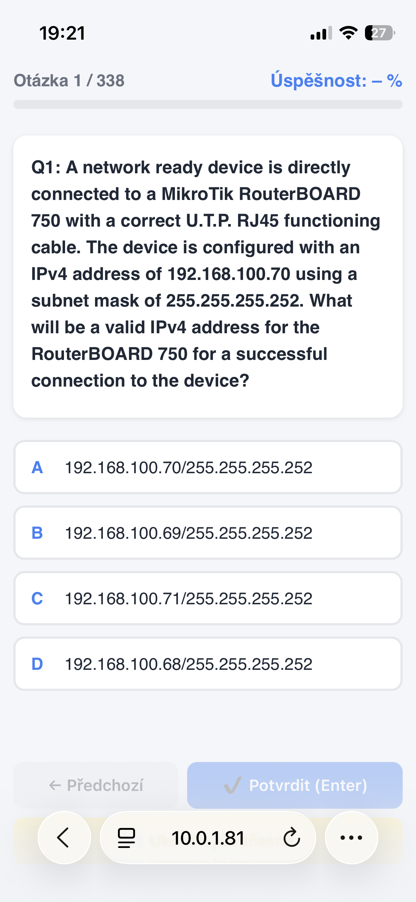
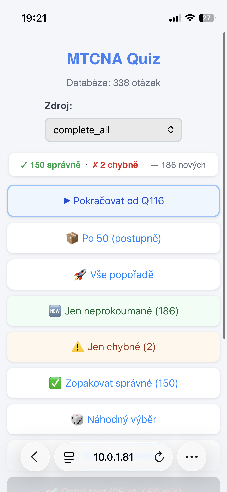

# MTCNA-app

> **Poznámka:** repo obsahuje jen samotnou kvízovou aplikaci (Flask
> server + UI). Žádné banky otázek zde nejsou a nejsou ani nikde
> v historii commitů — nejsou předmětem tohoto repozitáře.

MikroTik MTCNA cert kvíz appka. Dva běhy (localhost / LAN), jeden HTML
zdroj, průběžně ukládaný postup.

## Funkce

- **Více zdrojů otázek** — appka najde všechny `*.json` s bankou otázek
  vedle sebe a nabídne je v rozbalovacím seznamu "Zdroj".
- **Průběžný postup** — u každé otázky se pamatuje, jestli byla
  zodpovězena správně/chybně/vůbec, počítá se procentuální úspěšnost.
- **Pokračovat od poslední otázky** — appka nabídne návrat přesně tam,
  kde se skončilo minule.

### Režimy zkoušení

| Režim | Co dělá |
|---|---|
| 📦 Po X (postupně) | Rozdělí celou banku na bloky po X otázkách (velikost si nastavíš). Ke každému bloku vidíš rozpad na správné/chybné/nezodpovězené a v bloku pak můžeš zkoušet jen jeho podmnožinu (vše / jen nové / jen chybné / jen správné), nebo blok nejdřív "Studuj pak testuj". |
| 🚀 Vše popořadě | Celá banka otázek od začátku do konce. |
| 🆕 Jen neprozkoumané | Jen otázky, na které jsi ještě nikdy neodpovídal. |
| ⚠️ Jen chybné | Jen otázky, které jsi už někdy zodpověděl špatně. |
| ✅ Zopakovat správné | Zopakuje otázky, které máš zatím správně. |
| 🎲 Náhodný výběr | Zadáš počet a appka vybere náhodnou podmnožinu z celé banky. |
| 📖 Studuj pak testuj | Vezme neprozkoumané/chybné otázky, nejdřív je ukáže i s odpovědí ke studiu, pak z nich udělá test. |
| 🎯 Ostrý test | Simulace reálné MTCNA zkoušky — 25 otázek, 60 minut, 60 % na úspěch. |
| 💀 Sudden Death | Náhodné otázky, první špatná odpověď = konec ("GAME OVER"). |

### Ostatní

- 🗑 **Smazat progress tohoto zdroje** — vynuluje uložený postup pro aktuálně vybranou banku otázek.
- ❌ **Ukončit server** — vypne běžící Flask instanci přímo z UI.

## Screenshoty

### Desktop (localhost)

**Hlavní menu**



**Otázka**



**Bloky (Po 50)**



**Detail bloku**



### Síť / mobil (LAN)

**Otázka**



**Hlavní menu**



## Soubory

- `mtcna_web.py` — Flask app, port 5050, jen localhost. Obsahuje celé UI (`HTML` string) a `/api/*` routy.
- `mtcna_web_network.py` — Flask app pro LAN/testování na mobilu (importuje `HTML` přímo z `mtcna_web.py`, žádná duplikace).
- `mtcna_quiz_standalone.html` — starší statická verze bez serveru, vygenerovaná `build_pwa.py`. Bez chunk režimů, jednodušší.
- `build_pwa.py` — sestavení standalone verze z bank otázek.

## Spuštění

```bash
python3 mtcna_web.py            # localhost:5050
python3 mtcna_web_network.py    # LAN, pro test na telefonu
```

Banku otázek (JSON) je potřeba doplnit vlastní — stačí libovolný `*.json`
soubor vedle `mtcna_web.py` (kromě `progress.json`) v tomto formátu:

```json
[
  {
    "number": 1,
    "text": "Znění otázky",
    "options": ["Odpověď A", "Odpověď B", "Odpověď C"],
    "correct": 0
  }
]
```

Appka automaticky najde všechny takové soubory a nabídne je v
rozbalovacím seznamu "Zdroj" — žádná další registrace není potřeba.
